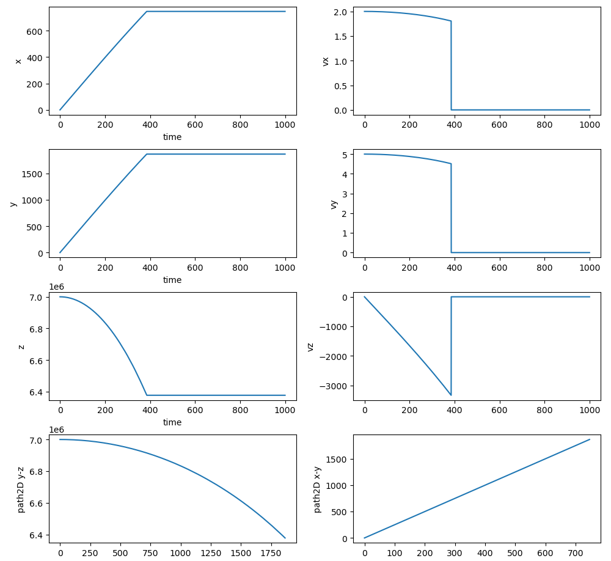
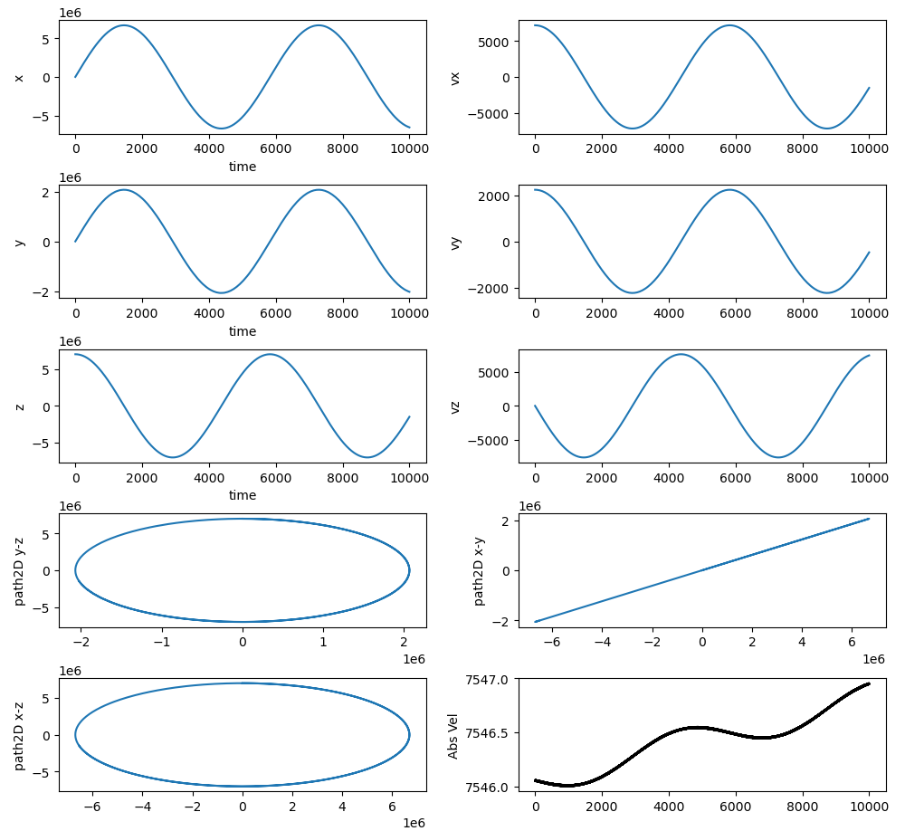

# demo_motion_dynamics
Dynamic model for space station motion

This repo contains motion dynamics of the space station, specifically attitude and orbital dynamics. This will be a part of physics model for the Space Station.

For reference, these will be the external forces and torque considered while designing the complete motion dynamics of the space station:

Torque considered:
- Gravity Gradient
- Magnetic Torque
- Aerodynamic Torque
- Solar Radiation Pressure Torque
- Added gaussian noise

Force considered:
- Atmospheric Drag
- Solar radiation pressure
- Micro-Gravity
- Thrusts*
- Added gaussian noise

## Objectives
Develop mathematical models of the space station's translational dynamics, accounting for external forces and environmental factors.

## Build and Run
```bash
colcon build
cd build/demo_motion_dynamics
./main

# To vusulaise the dynamics
python scripts/vis_data.py
```

### Without tangential velocity
Here it can be seen as soon as ISS loses it's tangential orbital velocity, it fell down to the Earth surface

## With tangential velocity


### More details regarding equations:
[Resources and Equations](resources/)

### Consideration
- Considered a static inertial earth frame
- Considered a constant atmospheric model that don't change dynamically and have constant pressure and density
- All the forces and dynamics are modelled wrt to inertial frame and output is in cartesian coordinate system
  
### TODO:
- Add more perturbation like solar radiation pressure, gaussian-noise, etc
- Shift to ROS2 and visualise the output live as the solver solves the equations
- Consider a rotational earth frame
- Add polar coordinate system for more observability
- Add a controller to adjust the orbital altitude once thrusters and enginers have been implemented
- Merge attitude dynamics
